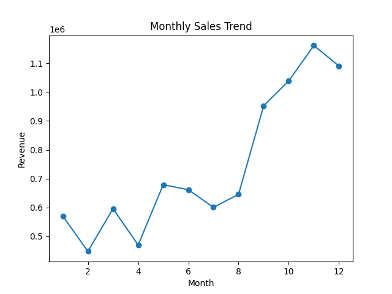
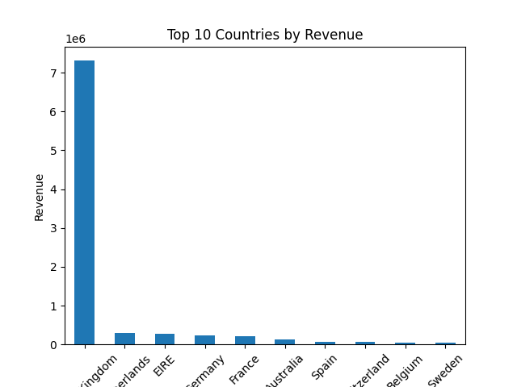
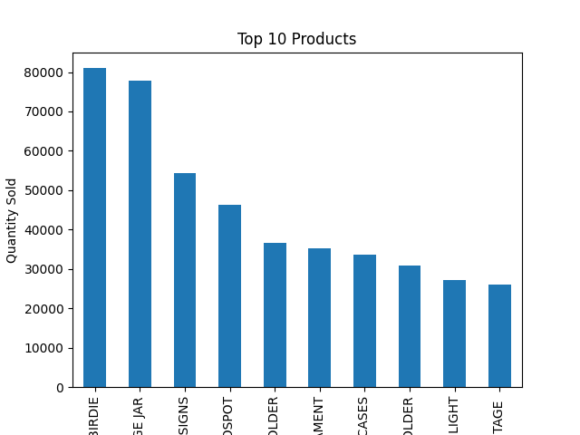
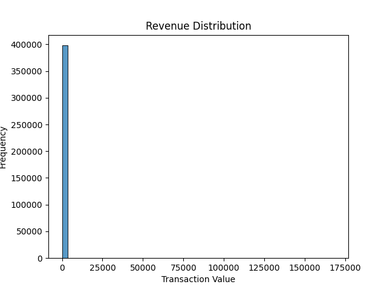

<!-- --    ----------- E-commerce Analytics Project ------------------- -->

# 🛒 E-commerce Sales & Customer Analytics Project

##  Problem Statement
This project analyzes e-commerce transactional data to understand sales trends, customer behavior, and revenue patterns.  
The goal is to extract actionable business insights that help improve marketing strategy, inventory management, and customer targeting.


##  Tools & Technologies Used
- Python
- Pandas, NumPy
- Matplotlib, Seaborn
- Jupyter Notebook
- SQL (for analysis queries)


## Project Workflow

### 1. Data Cleaning
- Removed missing values (CustomerID)
- Converted InvoiceDate into datetime format
- Removed invalid records (Quantity ≤ 0, UnitPrice ≤ 0)
- Created new feature: TotalPrice

### 2. Exploratory Data Analysis (EDA)
- Sales trend analysis
- Country-wise revenue analysis
- Product performance analysis

### 3. Customer Segmentation (RFM Analysis)
- Recency (Last purchase)
- Frequency (Number of purchases)
- Monetary (Total spending)
- Customer segmentation based on behavior


##  Visualizations

### 🔹 Monthly Sales Trend


### 🔹 Top Countries by Revenue


### 🔹 Top Products


### 🔹 Revenue Distribution



##  Key Insights

-  Majority of revenue comes from a small percentage of high-value customers
-  United Kingdom contributes the highest revenue among all countries
-  Few products dominate total sales (80/20 rule observed)
-  Sales increase significantly during specific months (seasonal trend)
-  Customer segmentation helps identify best, frequent, and at-risk customers

##  Business Impact

- Helps in targeting high-value customers with marketing campaigns
- Improves inventory planning based on demand patterns
- Identifies top-performing products for better stock management
- Supports data-driven decision making

###  Install dependencies
```bash
pip install -r requirements.txt
